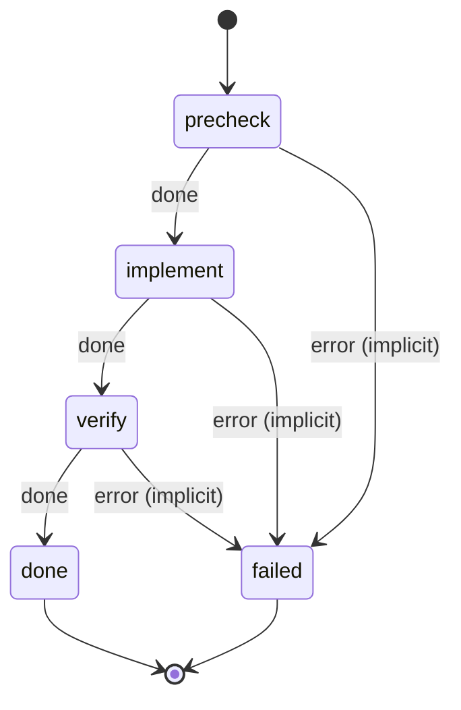

# develop

Implement a message with Claude, then have it verify the acceptance criteria.

Machine: [machines/develop.yml](../machines/develop.yml)

```mermaid
stateDiagram-v2
    [*] --> precheck
    implement --> verify: done
    implement --> failed: error (implicit)
    precheck --> implement: done
    precheck --> failed: error (implicit)
    verify --> done: done
    verify --> failed: error (implicit)
    done --> [*]
    failed --> [*]
```
