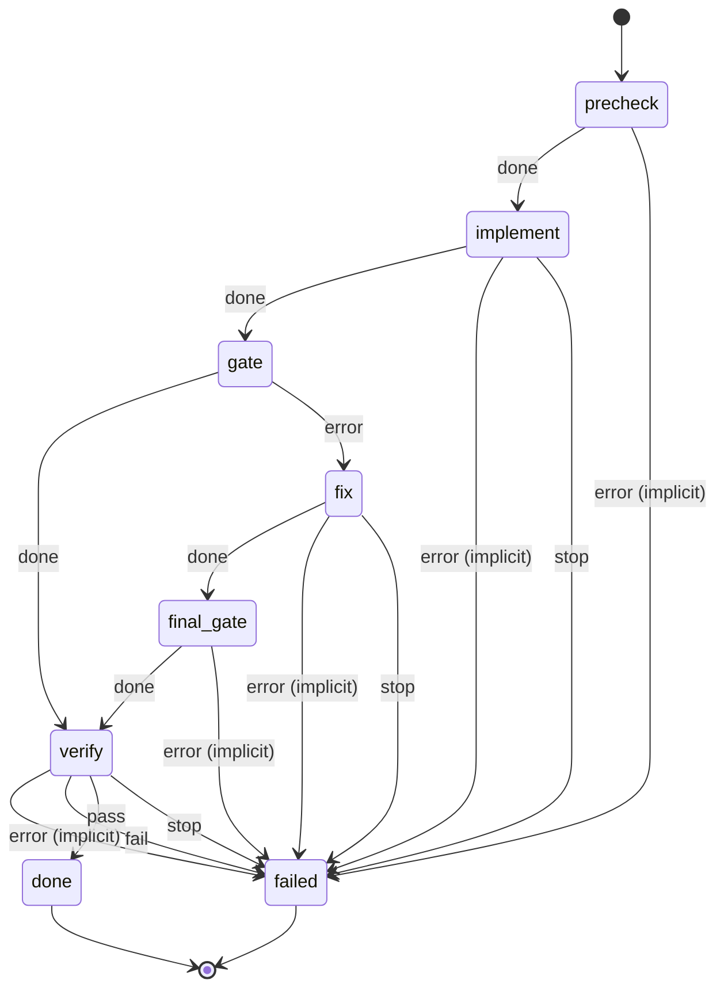

# develop

Implement a message with Claude in small, logged steps, run the project's gate, have Claude fix failures only if the gate fails, then have Claude check the acceptance criteria.

Machine: [machines/develop.yml](../machines/develop.yml)

