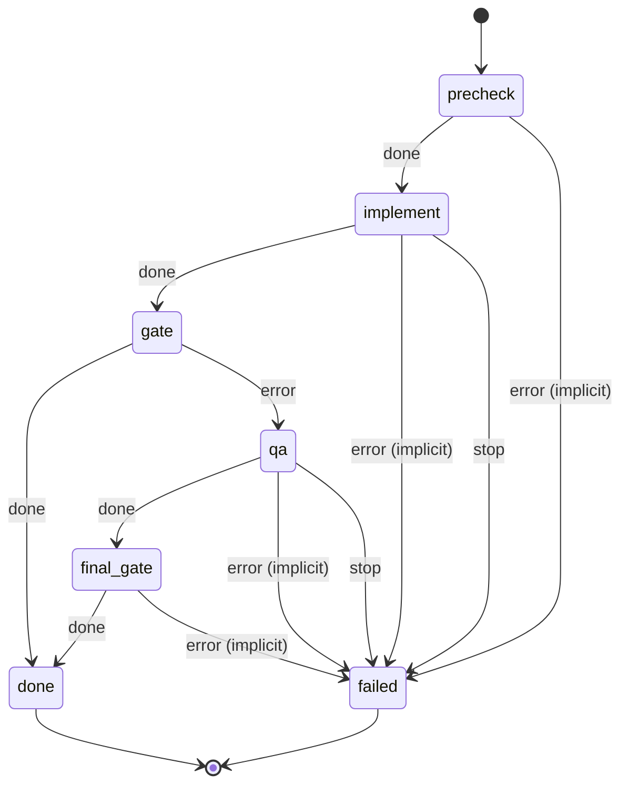

# go_develop

Implement a message in a Go project with Claude in small, logged steps, run the gate (gofmt, go vet, go test), and have Claude fix failures only if the gate fails.

Machine: [machines/go_develop.yml](../machines/go_develop.yml)

